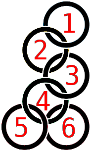

<div class="page">

<div id="preview-page" class="preview-page" data-autorefresh-url="">

<div role="main" class="main-content">

<div class="container new-discussion-timeline experiment-repo-nav">

<div class="repository-content">

<div id="readme" class="readme boxed-group clearfix announce instapaper_body md">

### <span class="octicon octicon-book"></span>The Rings of the Academy

<article class="markdown-body entry-content" itemprop="text" id="grip-content">

# [<span aria-hidden="true" class="octicon octicon-link"></span>](#the-rings-of-the-academy)The Rings of the Academy

## [<span aria-hidden="true" class="octicon octicon-link"></span>](#description)Description

Ah, the Rings.. they are round. They are numbered and attached to each other (see the image below).

[](imgs/rings1.png)

There will be **N** rings numbered **from 1 to N**. Exactly one of the rings is on the top, all others are hanging from it. Find the number of possible configurations of the rings so that the obey the hanging rules (see input).

_Example:_ If rings 2 and 3 are hanging from ring 1 there are 2 ways to order them (`2 left of 3` and `3 left of 2`).

## [<span aria-hidden="true" class="octicon octicon-link"></span>](#input)Input

*   Input is read from the console
    *   A number **N** is given on the first line
    *   On each of the next **N** lines a number is given describing the hanging rules
        *   which ring is ring 1 hanging from
        *   which ring is ring 2 hanging from
        *   ...
        *   `0` means that the ring is on the top

## [<span aria-hidden="true" class="octicon octicon-link"></span>](#output)Output

*   Output should be printed on the console
    *   Print the number of ring configurations on a single line

## [<span aria-hidden="true" class="octicon octicon-link"></span>](#constraints)Constraints

*   1 <= **N** <= 21
*   **Time limit**: **0.1s**
*   **Memory limit**: **16 MB**

## [<span aria-hidden="true" class="octicon octicon-link"></span>](#sample-tests)Sample tests

### [<span aria-hidden="true" class="octicon octicon-link"></span>](#sample-test-1)Sample test 1

#### [<span aria-hidden="true" class="octicon octicon-link"></span>](#input-1)Input

```
6
0
1
2
3
4
4

```

#### [<span aria-hidden="true" class="octicon octicon-link"></span>](#output-1)Output

```
2

```

### [<span aria-hidden="true" class="octicon octicon-link"></span>](#description-1)Description

```
Ring 5 and 6 can be swapped.
See image above.

```

### [<span aria-hidden="true" class="octicon octicon-link"></span>](#sample-test-2)Sample test 2

#### [<span aria-hidden="true" class="octicon octicon-link"></span>](#input-2)Input

```
6
0
1
1
1
3
3

```

#### [<span aria-hidden="true" class="octicon octicon-link"></span>](#output-2)Output

```
12

```

### [<span aria-hidden="true" class="octicon octicon-link"></span>](#sample-test-3)Sample test 3

#### [<span aria-hidden="true" class="octicon octicon-link"></span>](#input-3)Input

```
8
0
1
2
3
4
5
6
7

```

#### [<span aria-hidden="true" class="octicon octicon-link"></span>](#output-3)Output

```
1

```

</article>

</div>

</div>

</div>

</div>

</div>

</div>

<script>function showCanonicalImages() { var images = document.getElementsByTagName('img'); if (!images) { return; } for (var index = 0; index < images.length; index++) { var image = images[index]; if (image.getAttribute('data-canonical-src') && image.src !== image.getAttribute('data-canonical-src')) { image.src = image.getAttribute('data-canonical-src'); } } } function scrollToHash() { if (location.hash && !document.querySelector(':target')) { var element = document.getElementById('user-content-' + location.hash.slice(1)); if (element) { element.scrollIntoView(); } } } function autorefreshContent(eventSourceUrl) { var initialTitle = document.title; var contentElement = document.getElementById('grip-content'); var source = new EventSource(eventSourceUrl); var isRendering = false; source.onmessage = function(ev) { var msg = JSON.parse(ev.data); if (msg.updating) { isRendering = true; document.title = '(Rendering) ' + document.title; } else { isRendering = false; document.title = initialTitle; contentElement.innerHTML = msg.content; showCanonicalImages(); } } source.onerror = function(e) { if (e.readyState === EventSource.CLOSED && isRendering) { isRendering = false; document.title = initialTitle; } } } window.onhashchange = function() { scrollToHash(); } window.onload = function() { scrollToHash(); } showCanonicalImages(); var autorefreshUrl = document.getElementById('preview-page').getAttribute('data-autorefresh-url'); if (autorefreshUrl) { autorefreshContent(autorefreshUrl); }</script>