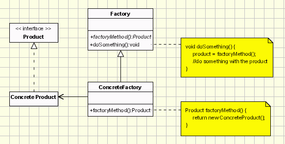

# Factory Method
An interface or base type is defined
Object creation is defered to subtypes - they decide which type to create and how to create it
Allows for multiple simple factory implementations
Future changes can be integrated by implementing an interface/inheriting a type without modifying the existing codebase
Allows to reuse common functionality with different components



## Intent
- Define an interface for creating an object, but let subclasses decide which class to instantiate. Factory Method lets a class defer instantiation to subclasses.
- Defining a "virtual" constructor.
- The new operator considered harmful.

## Discussion
Factory Method is to creating objects as Template Method is to implementing an algorithm. A superclass specifies all standard and generic behavior (using pure virtual "placeholders" for creation steps), and then delegates the creation details to subclasses that are supplied by the client.

Factory Method makes a design more customizable and only a little more complicated. Other design patterns require new classes, whereas Factory Method only requires a new operation.

People often use Factory Method as the standard way to create objects; but it isn't necessary if: the class that's instantiated never changes, or instantiation takes place in an operation that subclasses can easily override (such as an initialization operation).

Factory Method is similar to Abstract Factory but without the emphasis on families.

Factory Methods are routinely specified by an architectural framework, and then implemented by the user of the framework.

## Structure
A static method of a class that returns an object of that class' type. But unlike a constructor, the actual object it returns might be an instance of a subclass. Unlike a constructor, an existing object might be reused, instead of a new object created. Unlike a constructor, factory methods can have different and more descriptive names. The client is totally decoupled from the implementation details of derived classes. Polymorphic creation is now possible.

## Issues
- Factory Method prohibits parallel hierarchies.
Those hierarchies can become coupled.
A single change in one of the hierarchies might result in changes in the whole hierarchies.

## Rules of thumb
- Abstract Factory classes are often implemented with Factory Methods, but they can be implemented using Prototype.
- Factory Methods are usually called within Template Methods.
- Factory Method: creation through inheritance. Prototype: creation through delegation.
- Often, designs start out using Factory Method (less complicated, more customizable, subclasses proliferate) and evolve toward Abstract Factory, Prototype, or Builder (more flexible, more complex) as the designer discovers where more flexibility is needed.
- Prototype doesn't require subclassing, but it does require an Initialize operation. Factory Method requires subclassing, but doesn't require Initialize.
- The advantage of a Factory Method is that it can return the same instance multiple times, or can return a subclass rather than an object of that exact type.
- Some Factory Method advocates recommend that as a matter of language design (or failing that, as a matter of style) absolutely all constructors should be private or protected. It's no one else's business whether a class manufactures a new object or recycles an old one.
- The new operator considered harmful. There is a difference between requesting an object and creating one. The new operator always creates an object, and fails to encapsulate object creation. A Factory Method enforces that encapsulation, and allows an object to be requested without inextricable coupling to the act of creation.

## Implementation
1. If you have an inheritance hierarchy that exercises polymorphism, consider adding a polymorphic creation capability by defining a static factory method in the base class.
1. Design the arguments to the factory method. What qualities or characteristics are necessary and sufficient to identify the correct derived class to instantiate?
1. Consider designing an internal "object pool" that will allow objects to be reused instead of created from scratch.
1. Consider making all constructors private or protected.

## Example
The Factory Method defines an interface for creating objects, but lets subclasses decide which classes to instantiate. Injection molding presses demonstrate this pattern. Manufacturers of plastic toys process plastic molding powder, and inject the plastic into molds of the desired shapes. The class of toy (car, action figure, etc.) is determined by the mold.

```
public abstract class Document
{
    private List<Page> pages = new List<Page>();

    public Document()
    { 
        this.CreatePages();
    }

    public List<Page> Pages
    { 
        get 
        { 
            return this.pages;
        } 
    }

    public abstract void CreatePages();
}

public class CV : Document
{
    public override void CreatePages() {
        Pages.Add(new SkillsPage(), new BioPage());
    }
}

public class Report : Document
{
    public override void CreatePages() {
        Pages.Add(new ResultsPage, SummaryPage());
    }
}
```