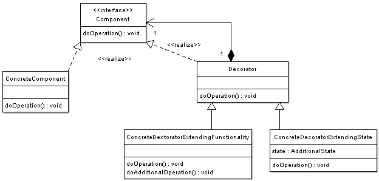

# Decorator
Add functionality to existing objects at run-time.
- Wrapping original component.
- Alternative to inheritance (class explosion).
- Support Open-Closed principle.
- Flexible design, original object is unaware.




## Intent
- Attach additional responsibilities to an object dynamically. Decorators provide a flexible alternative to subclassing for extending functionality.
- Client-specified embellishment of a core object by recursively wrapping it.
- Wrapping a gift, putting it in a box, and wrapping the box.

## Discussion
Suppose you are working on a user interface toolkit and you wish to support adding borders and scroll bars to windows. You could define an inheritance hierarchy, but the Decorator pattern suggests giving the client the ability to specify whatever combination of "features" is desired.

The solution to this class of problems involves encapsulating the original object inside an abstract wrapper interface. Both the decorator objects and the core object inherit from this abstract interface. The interface uses recursive composition to allow an unlimited number of decorator "layers" to be added to each core object.

Note that this pattern allows responsibilities to be added to an object, not methods to an object's interface. The interface presented to the client must remain constant as successive layers are specified.

Also note that the core object's identity has now been "hidden" inside of a decorator object. Trying to access the core object directly is now a problem.

## Structure
The client is always interested in CoreFunctionality.doThis(). The client may, or may not, be interested in OptionalOne.doThis() and OptionalTwo.doThis(). Each of these classes always delegate to the Decorator base class, and that class always delegates to the contained "wrappee" object.

## Rules of thumb
- Adapter provides a different interface to its subject. Proxy provides the same interface. Decorator provides an enhanced interface.
- Adapter changes an object's interface, Decorator enhances an object's responsibilities. Decorator is thus more transparent to the client. As a consequence, Decorator supports recursive composition, which isn't possible with pure Adapters.
- Composite and Decorator have similar structure diagrams, reflecting the fact that both rely on recursive composition to organize an open-ended number of objects.
- A Decorator can be viewed as a degenerate Composite with only one component. However, a Decorator adds additional responsibilities - it isn't intended for object aggregation.
- Decorator is designed to let you add responsibilities to objects without subclassing. Composite's focus is not on embellishment but on representation. These intents are distinct but complementary. Consequently, Composite and Decorator are often used in concert.
- Composite could use Chain of Responsibility to let components access global properties through their parent. It could also use Decorator to override these properties on parts of the composition.
- Decorator and Proxy have different purposes but similar structures. Both describe how to provide a level of indirection to another object, and the implementations keep a reference to the object to which they forward requests.
- Decorator lets you change the skin of an object. Strategy lets you change the guts.

## Implementation
1. Ensure the context is: a single core (or non-optional) component, several optional embellishments or wrappers, and an interface that is common to all.
1. Create a "Lowest Common Denominator" interface that makes all classes interchangeable.
1. Create a second level base class (Decorator) to support the optional wrapper classes.
1. The Core class and Decorator class inherit from the LCD interface.
1. The Decorator class declares a composition relationship to the LCD interface, and this data member is initialized in its constructor.
1. The Decorator class delegates to the LCD object.
1. Define a Decorator derived class for each optional embellishment.
1. Decorator derived classes implement their wrapper functionality - and - delegate to the Decorator base class.
1. The client configures the type and ordering of Core and Decorator objects.

## Example
The Adapter pattern allows otherwise incompatible classes to work together by converting the interface of one class into an interface expected by the clients. Socket wrenches provide an example of the Adapter. A socket attaches to a ratchet, provided that the size of the drive is the same.
```
internal abstract class LibraryItem
{
    public int CopiesCount { get; set; }

    public abstract void Display();
}

internal class Buyable : LibraryItem
{
    private readonly int price;
    private readonly LibraryItem item;

    public Buyable(LibraryItem item, int price)
    {
        this.price = price;
        this.item = item;
    }

    public override void Display()
    {
        this.item.Display();
        Console.WriteLine("Price: $" + this.price);
    }
}
```