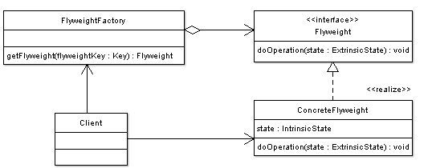

# Flyweight
Use sharing to support large numbers of fine-grained objects efficiently
- Reduce storage costs for large number of objects
- Share objects to be used in multiple contexts simultaneously
- Retain object oriented granularity and flexibility

Minimizes memory use bysharing as much data aspossible with other similar objects



## Intent
- Use sharing to support large numbers of fine-grained objects efficiently.
- The Motif GUI strategy of replacing heavy-weight widgets with light-weight gadgets.

## Discussion
The Flyweight pattern describes how to share objects to allow their use at fine granularity without prohibitive cost. Each "flyweight" object is divided into two pieces: the state-dependent (extrinsic) part, and the state-independent (intrinsic) part. Intrinsic state is stored (shared) in the Flyweight object. Extrinsic state is stored or computed by client objects, and passed to the Flyweight when its operations are invoked.

An illustration of this approach would be Motif widgets that have been re-engineered as light-weight gadgets. Whereas widgets are "intelligent" enough to stand on their own; gadgets exist in a dependent relationship with their parent layout manager widget. Each layout manager provides context-dependent event handling, real estate management, and resource services to its flyweight gadgets, and each gadget is only responsible for context-independent state and behavior.

## Structure
Flyweights are stored in a Factory's repository. The client restrains herself from creating Flyweights directly, and requests them from the Factory. Each Flyweight cannot stand on its own. Any attributes that would make sharing impossible must be supplied by the client whenever a request is made of the Flyweight. If the context lends itself to "economy of scale" (i.e. the client can easily compute or look-up the necessary attributes), then the Flyweight pattern offers appropriate leverage.

## Rules of thumb
- Whereas Flyweight shows how to make lots of little objects, Facade shows how to make a single object represent an entire subsystem.
- Flyweight is often combined with Composite to implement shared leaf nodes.
- Terminal symbols within Interpreter's abstract syntax tree can be shared with Flyweight.
- Flyweight explains when and how State objects can be shared.

## Implementation
1. Ensure that object overhead is an issue needing attention, and, the client of the class is able and willing to absorb responsibility realignment.
1. Divide the target class's state into: shareable (intrinsic) state, and non-shareable (extrinsic) state.
1. Remove the non-shareable state from the class attributes, and add it the calling argument list of affected methods.
1. Create a Factory that can cache and reuse existing class instances.
1. The client must use the Factory instead of the new operator to request objects.
1. The client (or a third party) must look-up or compute the non-shareable state, and supply that state to class methods.

## Example
The Adapter pattern allows otherwise incompatible classes to work together by converting the interface of one class into an interface expected by the clients. Socket wrenches provide an example of the Adapter. A socket attaches to a ratchet, provided that the size of the drive is the same.
```
    public abstract class Character
    {
        protected char Symbol { get; set; }

        protected int Width { get; set; }

        protected int Height { get; set; }

        protected int Ascent { get; set; }

        protected int Descent { get; set; }

        public abstract void Display(int pointSize);
    }

    public class CharacterA : Character
    {
        public CharacterA()
        {
            this.Symbol = 'A';
            this.Height = 100;
            this.Width = 120;
            this.Ascent = 70;
            this.Descent = 0;
        }

        public override void Display(int pointSize)
        {
            Console.WriteLine("{0} (point size {1})", this.Symbol, pointSize);
        }
    }

    public class CharacterFactory
    {
        private readonly Dictionary<char, Character> characters = new Dictionary<char, Character>();

        public int NumberOfObjects
        {
            get
            {
                return this.characters.Count;
            }
        }

        public Character GetCharacter(char key)
        {
            // Uses "lazy initialization"
            Character character = null;
            if (this.characters.ContainsKey(key))
            {
                character = this.characters[key];
            }
            else
            {
                switch (key)
                {
                    case 'A':
                        character = new CharacterA();
                        break;
                    // ..
                }

                this.characters.Add(key, character);
            }

            return character;
        }
    }
```