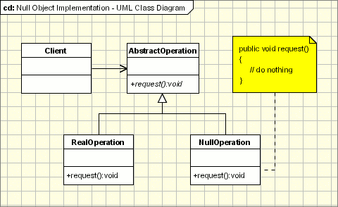

# Null Object
Designed to act as a default value of an object
- Rid program logic of null checks
- Provide a non-functional object replacement



## Intent
- The intent of a Null Object is to encapsulate the absence of an object by providing a substitutable alternative that offers suitable default do nothing behavior. In short, a design where "nothing will come of nothing"
- Use the Null Object pattern when:
    1. an object requires a collaborator. The Null Object pattern does not introduce this collaboration--it makes use of a collaboration that already exists
    1. some collaborator instances should do nothing
    1. you want to abstract the handling of null away from the client

## Discussion
Sometimes a class that requires a collaborator does not need the collaborator to do anything. However, the class wishes to treat a collaborator that does nothing the same way it treats one that actually provides behavior.

Consider for example a simple screen saver which displays balls that move about the screen and have special color effects. This is easily achieved by creating a Ball class to represent the balls and using a Strategy pattern to control the ball's motion and another Strategy pattern to control the ball's color.

It would then be trivial to write strategies for many different types of motion and color effects and create balls with any combination of those. However, to start with you want to create the simplest strategies possible to make sure everything is working. And these strategies could also be useful later since you want as strategies as possible strategies.

Now, the simplest strategy would be no strategy. That is do nothing, don't move and don't change color. However, the Strategy pattern requires the ball to have objects which implement the strategy interfaces. This is where the Null Object pattern becomes useful.

Simply implement a NullMovementStrategy which doesn't move the ball and a NullColorStrategy which doesn't change the ball's color. Both of these can probably be implemented with essentially no code. All the methods in these classes do "nothing". They are perfect examples of the Null Object Pattern.

The key to the Null Object pattern is an abstract class that defines the interface for all objects of this type. The Null Object is implemented as a subclass of this abstract class. Because it conforms to the abstract class' interface, it can be used any place this type of object is needed. As compared to using a special "null" value which doesn't actually implement the abstract interface and which must constantly be checked for with special code in any object which uses the abstract interface.

It is sometimes thought that Null Objects are over simple and "stupid" but in truth a Null Object always knows exactly what needs to be done without interacting with any other objects. So in truth it is very "smart."

## Structure
- Client -
    1. requires a collaborator.
- AbstractObject -
    1. declares the interface for Client's collaborator
    1. implements default behavior for the interface common to all classes, as appropriate
- RealObject -
    1. defines a concrete subclass of AbstractObject whose instances provide useful behavior that Client expects
- NullObject -
    1. provides an interface identical to AbstractObject's so that a null object can be substituted for a real object
    1. implements its interface to do nothing. What exactly it means to do nothing depends on what sort of behavior Client is expecting
    1. when there is more than one way to do nothing, more than one NullObject class may be required

## Rules of thumb
- The Null Object class is often implemented as a Singleton. Since a null object usually does not have any state, its state can't change, so multiple instances are identical. Rather than use multiple identical instances, the system can just use a single instance repeatedly.
- If some clients expect the null object to do nothing one way and some another, multiple NullObject classes will be required. If the do nothing behavior must be customized at run time, the NullObject class will require pluggable variables so that the client can specify how the null object should do nothing (see the discussion of pluggable adaptors in the Adapter pattern). This may generally be a symptom of the AbstractObject not having a well defined (semantic) interface.
- A Null Object does not transform to become a Real Object. If the object may decide to stop providing do nothing behavior and start providing real behavior, it is not a null object. It may be a real object with a do nothing mode, such as a controller which can switch in and out of read-only mode. - If it is a single object which must mutate from a do nothing object to a real one, it should be implemented with the State pattern or perhaps the Proxy pattern. In this case a Null State may be used or the proxy may hold a Null Object.
- The use of a null object can be similar to that of a Proxy, but the two patterns have different purposes. A proxy provides a level of indirection when accessing a real subject, thus controlling access to the subject. A null collaborator does not hide a real object and control access to it, it replaces the real object. A proxy may eventually mutate to start acting like a real subject. A null object will not mutate to start providing real behavior, it will always provide do nothing behavior.
- A Null Object can be a special case of the Strategy pattern. Strategy specifies several ConcreteStrategy classes as different approaches for accomplishing a task. If one of those approaches is to consistently do nothing, that ConcreteStrategy is a NullObject. For example, a Controller is a View's Strategy for handling input, and NoController is the Strategy that ignores all input.
- A Null Object can be a special case of the State pattern. Normally, each ConcreteState has some do nothing methods because they're not appropriate for that state. In fact, a given method is often implemented to do something useful in most states but to do nothing in at least one state. If a particular ConcreteState implements most of its methods to do nothing or at least give null results, it becomes a do nothing state and as such is a null state.
- A Null Object can be used to allow a Visitor to safely visit a hierarchy and handle the null situation.
- Null Object is a concrete collaborator class that acts as the collaborator for a client which needs one. The null behavior is not designed to be mixed into an object that needs some do nothing behavior. It is designed for a class which delegates to a collaborator all of the behavior that may or may not be do nothing behavior.

## Example
```
public class Animal {
    private string name;
    private string species;

	protected Animal() { }

	public Animal(string name, string species) {
		this.Name = name;
		this.Species = species;
	}

	public virtual string Name {
		get { return this.name; }
		set { this.name = value; }
	}

	public virtual string Species {
		get { return this.species; }
		set { this.species = value; }
	}
}

public sealed class NullAnimal : Animal {
	public override string Name {
		get { return String.Empty; }
		set { }
	}
	public override string Species {
		get { return String.Empty; }
		set { }
	}
}
```